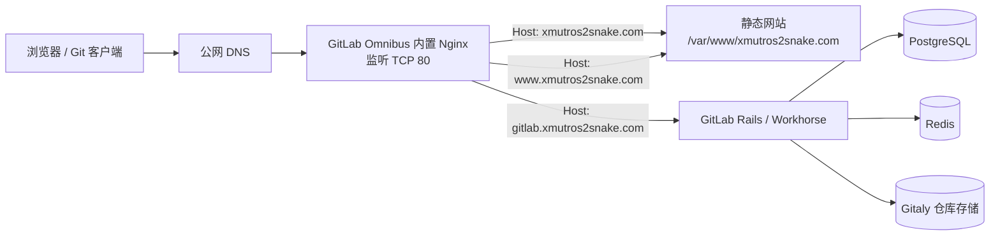

# GitLab 与静态网站 Nginx 配置及架构总结

> 最后核对时间：2026-09-12（Asia/Shanghai）  
> 服务器：`VM-0-8-ubuntu`  
> GitLab：GitLab CE 19.3.1  
> 当前状态：HTTP 已配置并通过内网与公网验证，HTTPS 尚未配置

## 1. 当前访问入口

| 用途 | 地址 | 当前结果 |
| --- | --- | --- |
| 主网站 | <http://xmutros2snake.com> | `200 OK` |
| 主网站（www） | <http://www.xmutros2snake.com> | `200 OK` |
| GitLab | <http://gitlab.xmutros2snake.com> | `302` 跳转到 `/users/sign_in` |

目前必须使用 `http://`。浏览器显示“不安全”是因为尚未配置 TLS/HTTPS 证书。

## 2. 整体架构



这是一台 All-in-One GitLab 服务器。GitLab 自带的 Omnibus Nginx 是唯一的 HTTP 入口，不需要再启动一套 Ubuntu 系统 Nginx。Nginx 根据请求中的 `Host` 头把流量分发给静态网站或 GitLab。

## 3. 核心组件与职责

| 组件 | 职责 | 当前配置 |
| --- | --- | --- |
| 公网 DNS | 将三个域名指向服务器 | 已可从公网访问 |
| GitLab Omnibus Nginx | 统一接收和分流 HTTP 请求 | 监听 `0.0.0.0:80` |
| 静态网站虚拟主机 | 服务根域名和 `www` 域名 | 返回 `/var/www/xmutros2snake.com/index.html` |
| GitLab 虚拟主机 | 服务 GitLab 子域名 | `external_url` 为 `http://gitlab.xmutros2snake.com` |
| GitLab Workhorse / Puma | 处理 GitLab Web 请求 | 服务运行正常 |
| PostgreSQL / Redis / Gitaly | 数据库、缓存和 Git 仓库 | 服务运行正常 |

服务器上的 Nginx 还监听了 `0.0.0.0:8060`。该端口通常用于状态/监控，应该确认云安全组和系统防火墙没有向公网开放它。

## 4. 关键文件位置

| 文件或目录 | 用途 |
| --- | --- |
| `/etc/gitlab/gitlab.rb` | GitLab Omnibus 的主配置文件 |
| `/var/opt/gitlab/nginx/conf/nginx.conf` | `gitlab-ctl reconfigure` 自动生成的 Nginx 主配置，不应直接编辑 |
| `/etc/gitlab/nginx/sites-available/xmutros2snake.com.conf` | 静态网站的 Nginx 虚拟主机配置 |
| `/etc/gitlab/nginx/sites-enabled/xmutros2snake.com.conf` | 指向 `sites-available` 配置的符号链接 |
| `/var/www/xmutros2snake.com/` | 静态网站根目录 |
| `/var/www/xmutros2snake.com/index.html` | 当前网站首页 |
| `/var/log/gitlab/nginx/xmutros2snake_access.log` | 静态网站访问日志 |
| `/var/log/gitlab/nginx/xmutros2snake_error.log` | 静态网站错误日志 |
| `/etc/gitlab/gitlab.rb.codex-backup-20260912-1` | 本次修改前的 `gitlab.rb` 备份 |

## 5. 当前生效配置

### 5.1 GitLab 主配置中的自定义 include

`/etc/gitlab/gitlab.rb` 中已启用：

```ruby
nginx["custom_nginx_config"] = "include /etc/gitlab/nginx/sites-enabled/*.conf;"
```

执行 `gitlab-ctl reconfigure` 后，GitLab 将它写入自动生成的 `/var/opt/gitlab/nginx/conf/nginx.conf` 的 `http` 块：

```nginx
include /etc/gitlab/nginx/sites-enabled/*.conf;
```

注意：Ruby 配置行只能写入 `gitlab.rb`，不能直接在 Bash 中执行，否则会出现：

```text
nginx[custom_nginx_config]: command not found
```

### 5.2 静态网站虚拟主机

`/etc/gitlab/nginx/sites-available/xmutros2snake.com.conf`：

```nginx
server {
    listen 80;
    server_name xmutros2snake.com www.xmutros2snake.com;

    root /var/www/xmutros2snake.com;
    index index.html;

    access_log /var/log/gitlab/nginx/xmutros2snake_access.log;
    error_log /var/log/gitlab/nginx/xmutros2snake_error.log;

    location / {
        try_files $uri $uri/ /index.html;
    }
}
```

`try_files ... /index.html` 使前端单页应用的客户端路由也能回退到首页。

启用链接：

```text
/etc/gitlab/nginx/sites-enabled/xmutros2snake.com.conf
  -> /etc/gitlab/nginx/sites-available/xmutros2snake.com.conf
```

### 5.3 GitLab 域名

当前最终生效的配置为：

```ruby
external_url 'http://gitlab.xmutros2snake.com'
letsencrypt['enable'] = false
letsencrypt['auto_renew'] = false
```

`gitlab.rb` 前部仍有一条未注释的示例配置：

```ruby
external_url 'http://gitlab.example.com'
```

由于后面再次设置了正确地址，当前生成配置和访问结果都是正确的。为避免后续升级或维护时产生歧义，建议以后将前面的示例行注释掉，只保留一条有效的 `external_url`。

## 6. 已完成的配置流程

1. 使用以下请求确认 GitLab 自身已经正常处理请求：

   ```bash
   curl -I -H 'Host: gitlab.xmutros2snake.com' http://127.0.0.1/
   ```

   返回 `302` 并跳转登录页，说明 GitLab、Workhorse 和原有 Nginx 虚拟主机正常。

2. 确认静态网站配置、符号链接及首页文件已存在：

   ```text
   /etc/gitlab/nginx/sites-available/xmutros2snake.com.conf
   /etc/gitlab/nginx/sites-enabled/xmutros2snake.com.conf
   /var/www/xmutros2snake.com/index.html
   ```

3. 通过 SSH 公钥连接服务器，并确认 `ubuntu` 用户具有免密码 `sudo` 权限。没有在文档中记录密码、私钥或其他秘密信息。

4. 修改前备份 GitLab 配置：

   ```text
   /etc/gitlab/gitlab.rb.codex-backup-20260912-1
   ```

5. 在 `gitlab.rb` 中设置 `nginx["custom_nginx_config"]`，让 GitLab 内置 Nginx 加载 `sites-enabled/*.conf`。

6. 应用配置：

   ```bash
   sudo gitlab-ctl reconfigure
   ```

   重配置成功，并自动重启了 GitLab 内置 Nginx。

7. 验证 Nginx 配置、服务状态、本机 Host 路由和公网访问，结果均符合预期。

## 7. 标准验证命令

### 7.1 检查生成的 include

```bash
sudo grep -n "sites-enabled" /var/opt/gitlab/nginx/conf/nginx.conf
```

预期包含：

```text
include /etc/gitlab/nginx/sites-enabled/*.conf;
```

### 7.2 检查 GitLab 内置 Nginx 语法

必须传入 GitLab Nginx 的运行前缀：

```bash
sudo /opt/gitlab/embedded/sbin/nginx \
  -t \
  -p /var/opt/gitlab/nginx \
  -c conf/nginx.conf
```

预期结果：

```text
syntax is ok
test is successful
```

如果省略 `-p /var/opt/gitlab/nginx`，测试程序可能错误地在 `/opt/gitlab/embedded/logs/` 中查找日志文件，从而产生与实际服务配置无关的报错。

### 7.3 检查服务

```bash
sudo gitlab-ctl status nginx
sudo gitlab-ctl status
```

### 7.4 在服务器本机验证虚拟主机分流

```bash
curl -I -H 'Host: xmutros2snake.com' http://127.0.0.1/
curl -I -H 'Host: www.xmutros2snake.com' http://127.0.0.1/
curl -I -H 'Host: gitlab.xmutros2snake.com' http://127.0.0.1/
```

预期：前两条返回 `200`；第三条返回 `302`，且 `Location` 指向 GitLab 登录页。

### 7.5 从公网验证

```bash
curl -I http://xmutros2snake.com/
curl -I http://www.xmutros2snake.com/
curl -I http://gitlab.xmutros2snake.com/
```

## 8. 日常维护流程

### 8.1 更新静态网站

将构建完成的静态文件部署到：

```text
/var/www/xmutros2snake.com/
```

文件至少要允许 `gitlab-www` 用户读取，父目录也要允许目录遍历。可用以下命令检查首页：

```bash
sudo -u gitlab-www test -r /var/www/xmutros2snake.com/index.html \
  && echo readable \
  || echo not-readable
```

只替换 HTML、CSS、JavaScript 或图片时，通常不需要重启 Nginx。

### 8.2 修改静态网站 Nginx 配置

修改：

```text
/etc/gitlab/nginx/sites-available/xmutros2snake.com.conf
```

然后依次执行：

```bash
sudo /opt/gitlab/embedded/sbin/nginx \
  -t \
  -p /var/opt/gitlab/nginx \
  -c conf/nginx.conf

sudo gitlab-ctl restart nginx
```

### 8.3 修改 `gitlab.rb`

修改 `/etc/gitlab/gitlab.rb` 后必须执行：

```bash
sudo gitlab-ctl reconfigure
```

不要直接编辑 `/var/opt/gitlab/nginx/conf/nginx.conf`，因为下一次 `reconfigure` 会重新生成并覆盖它。

### 8.4 查看日志

```bash
sudo tail -f /var/log/gitlab/nginx/xmutros2snake_access.log
sudo tail -f /var/log/gitlab/nginx/xmutros2snake_error.log
sudo gitlab-ctl tail nginx
```

## 9. 回滚方法

如果本次 `gitlab.rb` 修改导致异常，可以恢复明确的备份文件：

```bash
sudo cp -a \
  /etc/gitlab/gitlab.rb.codex-backup-20260912-1 \
  /etc/gitlab/gitlab.rb

sudo gitlab-ctl reconfigure
```

恢复前应先确认该备份仍是希望回到的版本，避免覆盖之后新增的 GitLab 配置。

## 10. 当前待办与安全建议

1. **配置 HTTPS**：目前三个域名均为 HTTP。应为 `xmutros2snake.com`、`www.xmutros2snake.com` 和 `gitlab.xmutros2snake.com` 配置证书，并将 HTTP 重定向至 HTTPS。
2. **清理重复 `external_url`**：注释掉 `http://gitlab.example.com` 示例，只保留正确的 GitLab 地址。
3. **检查 8060 端口**：确保云安全组和系统防火墙未向公网开放 Nginx 状态端口。
4. **复核 SSH 授权**：本次为远程配置添加了公钥。若不再需要持续管理，应在服务器的 `~/.ssh/authorized_keys` 中删除对应公钥；不要删除其他管理员的密钥。
5. **配置备份**：建议定期备份 `/etc/gitlab`、GitLab 数据和静态网站目录，并验证恢复流程。

## 11. 常见故障速查

| 现象 | 常见原因 | 检查方法 |
| --- | --- | --- |
| 根域名进入 GitLab | 自定义 include 未生效或 `server_name` 不匹配 | 检查生成配置中的 `sites-enabled` include |
| `command not found` | 把 Ruby 配置行当作 Bash 命令执行 | 将配置写入 `/etc/gitlab/gitlab.rb` 后运行 `reconfigure` |
| 静态网站返回 `403` | 文件或父目录权限不足 | 用 `sudo -u gitlab-www test -r ...` 检查 |
| 静态网站返回 `404` | `root`、文件路径或符号链接错误 | 检查站点配置及 `/var/www/xmutros2snake.com` |
| GitLab 返回 `502` | Workhorse、Puma 或其他 GitLab 服务异常 | 运行 `sudo gitlab-ctl status` 和 `sudo gitlab-ctl tail` |
| 浏览器强制 HTTPS 后打不开 | 当前尚未监听 443 或没有证书 | 明确输入 `http://`，随后完成 HTTPS 配置 |
| 手工 `nginx -t` 报日志路径错误 | 没有传入 GitLab Nginx 前缀 | 使用本文第 7.2 节的完整命令 |

