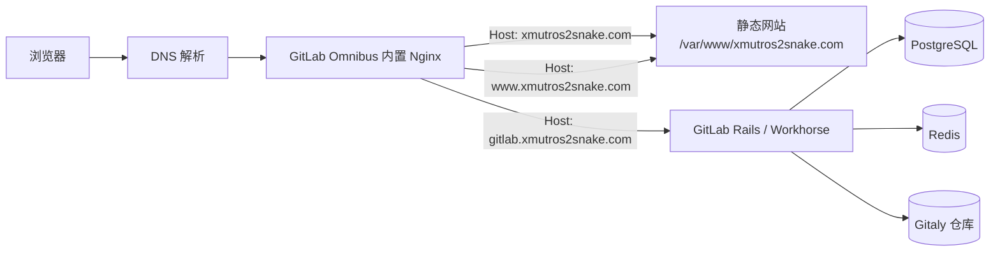
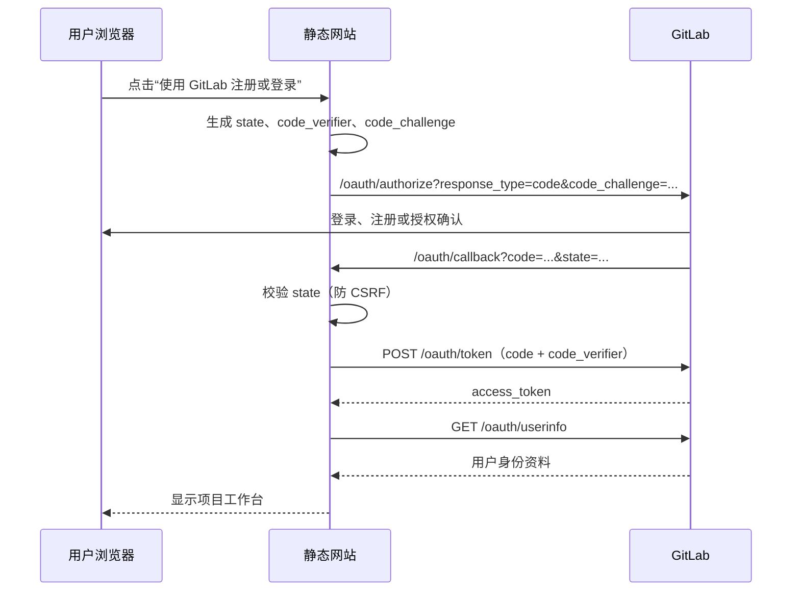

# 网站、GitLab、HTTPS 与 OAuth 操作及原理

> 整理日期：2026-09-21（Asia/Shanghai）  
> 适用服务器：`VM-0-8-ubuntu`（GitLab CE 19.3.1）  
> 本文区分“已完成”和“待执行”。配置文件已编辑或命令已建议执行，不等于已经在服务器生效。

## 1. 目标与全局架构

此部署将静态项目网站、自建 GitLab 和 GitLab OAuth 登录部署在同一台服务器上：



同一公网 IP 可以服务多个域名，是因为浏览器在 HTTP 请求中携带 `Host` 头，而 HTTPS 建连时还会通过 SNI 携带目标域名。Nginx 依据域名选择对应的 `server` 块，不需要为三个域名分别购买服务器。

### 域名用途

| 域名 | 用途 | 后端内容 |
| --- | --- | --- |
| `xmutros2snake.com` | 主网站 | 静态网页 |
| `www.xmutros2snake.com` | 主网站别名 | 同一静态网页 |
| `gitlab.xmutros2snake.com` | 自建 GitLab | GitLab Web、API、Git 仓库 |

## 2. 当前进度总览

| 项目 | 状态 | 说明 |
| --- | --- | --- |
| 域名备案 | 已完成 | 域名可用于当前国内云服务器网站部署。备案与 HTTPS 证书是两件不同的事。 |
| DNS A 记录 | 已完成 | `@`、`www`、`gitlab` 均指向 `203.195.206.69`，TTL 为 600 秒。 |
| HTTP 网站 | 已完成 | 主网站返回 `200`，GitLab 返回至登录页的 `302`。 |
| SSL 证书申请 | 已完成 | 根域名/`www` 共用一张 SAN 证书；GitLab 使用单独证书。 |
| 证书上传 | 已完成 | 已复制到 `/etc/gitlab/ssl`，证书为 `644`，私钥为 `600 root:root`。 |
| HTTPS Nginx 配置 | 待执行 | 需要修改 `gitlab.rb`、静态网站虚拟主机并运行重配置。 |
| OAuth 前端代码 | 已完成但暂不可用 | 代码已使用 PKCE；在 HTTPS 完成前会主动拒绝授权。 |
| OAuth 应用回调地址改为 HTTPS | 待执行 | HTTPS 验证成功后再改 GitLab 应用设置。 |

## 3. DNS、备案与端口

### 3.1 DNS 为什么这样配置

DNS 负责把名称转换为 IP。当前三条 A 记录都指向同一服务器：

```text
@       A  203.195.206.69
www     A  203.195.206.69
gitlab  A  203.195.206.69
```

`@` 代表根域名 `xmutros2snake.com`。`www` 和 `gitlab` 是子域名。网页和 GitLab 的区分不是 DNS 完成的，而是 Nginx 收到请求后依据域名完成的。

### 3.2 备案、DNS、SSL 的区别

| 项目 | 解决的问题 | 当前状态 |
| --- | --- | --- |
| ICP 备案 | 在中国大陆云服务器提供网站服务的合规要求 | 已完成 |
| DNS 解析 | 用户访问域名时能找到服务器 | 已完成 |
| SSL/TLS 证书 | 浏览器与服务器之间的加密与域名身份校验 | 证书已上传，尚未启用 |

备案不自动提供 HTTPS；HTTPS 也不替代备案。

### 3.3 防火墙与安全组

至少需要允许公网入站：

| 端口 | 协议 | 用途 |
| --- | --- | --- |
| 22 | TCP | SSH 管理 |
| 80 | TCP | HTTP，以及 HTTP 到 HTTPS 的跳转 |
| 443 | TCP | HTTPS 网站、GitLab 和 OAuth |

云安全组与服务器本机防火墙是两层规则；任意一层阻断 443，外网 HTTPS 都无法访问。若启用了 UFW：

```bash
sudo ufw allow 443/tcp
```

## 4. Nginx 与 GitLab Omnibus 原理

GitLab Linux Package（Omnibus）自带 Nginx、PostgreSQL、Redis、Gitaly、Puma/Workhorse 等服务。此服务器不额外运行 Ubuntu 系统 Nginx；GitLab 自带的 Nginx 是统一入口。

### 4.1 不应直接修改的文件

```text
/var/opt/gitlab/nginx/conf/nginx.conf
```

该文件由 `sudo gitlab-ctl reconfigure` 自动生成。直接改它会在下一次重配置时丢失。

### 4.2 应修改的文件

| 路径 | 用途 |
| --- | --- |
| `/etc/gitlab/gitlab.rb` | GitLab Omnibus 主配置；定义 `external_url`、证书路径、HTTPS 行为。 |
| `/etc/gitlab/nginx/sites-available/xmutros2snake.com.conf` | 静态网站的自定义 Nginx 虚拟主机。 |
| `/etc/gitlab/nginx/sites-enabled/xmutros2snake.com.conf` | 指向 `sites-available` 的符号链接。 |
| `/etc/gitlab/ssl/` | 证书和私钥，私钥不能提交到 Git。 |

`gitlab.rb` 已通过以下配置把自定义虚拟主机 include 到 GitLab Nginx 的 `http` 块：

```ruby
nginx['custom_nginx_config'] = "include /etc/gitlab/nginx/sites-enabled/*.conf;"
```

### 4.3 单页应用为什么需要 `try_files`

静态站点使用：

```nginx
try_files $uri $uri/ /index.html;
```

浏览器访问 `/oauth/callback` 时，服务器上没有真实的 `/oauth/callback` 文件。该规则会回退到 `index.html`，再由网页 JavaScript 读取 URL 中的 OAuth 参数。这是单页应用（SPA）客户端路由的常见方式。

## 5. SSL 证书与 HTTPS

### 5.1 已获得的证书

| 证书用途 | 服务器目标路径 | 私钥目标路径 |
| --- | --- | --- |
| 根域名与 `www` | `/etc/gitlab/ssl/xmutros2snake.com.crt` | `/etc/gitlab/ssl/xmutros2snake.com.key` |
| GitLab 子域名 | `/etc/gitlab/ssl/gitlab.xmutros2snake.com.crt` | `/etc/gitlab/ssl/gitlab.xmutros2snake.com.key` |

根域名证书的 SAN 包含：

```text
DNS:xmutros2snake.com
DNS:www.xmutros2snake.com
```

因此一张证书可以服务根域名和 `www`。GitLab 证书只包含 `gitlab.xmutros2snake.com`，因此必须使用单独的证书文件。

### 5.2 权限为什么不同

```text
*.crt  644 root:root  # 公钥证书，可被 Nginx 读取
*.key  600 root:root  # 私钥，只允许 root 读取
```

证书是公开信息；私钥一旦泄露，攻击者可以伪装服务器。`.key` 不应上传到 GitLab、聊天记录、网盘公开链接或网站目录。

### 5.3 待执行：启用 GitLab HTTPS

先备份：

```bash
sudo cp -an /etc/gitlab/gitlab.rb /etc/gitlab/gitlab.rb.before-https
sudo cp -an /etc/gitlab/nginx/sites-available/xmutros2snake.com.conf \
  /etc/gitlab/nginx/sites-available/xmutros2snake.com.conf.before-https
```

在 `/etc/gitlab/gitlab.rb` 中，确保只有最终一条有效的 `external_url`，并使用：

```ruby
external_url 'https://gitlab.xmutros2snake.com'

letsencrypt['enable'] = false
letsencrypt['contact_emails'] = ['<管理员邮箱>']
letsencrypt['auto_renew'] = false

gitlab_rails['nginx']['ssl_certificate'] = '/etc/gitlab/ssl/gitlab.xmutros2snake.com.crt'
gitlab_rails['nginx']['ssl_certificate_key'] = '/etc/gitlab/ssl/gitlab.xmutros2snake.com.key'
gitlab_rails['nginx']['redirect_http_to_https'] = true
```

文件前部的示例配置应注释，避免两个 `external_url` 产生维护歧义：

```ruby
# external_url 'http://gitlab.example.com'
```

### 5.4 待执行：启用静态网站 HTTPS

将 `/etc/gitlab/nginx/sites-available/xmutros2snake.com.conf` 替换为：

```nginx
server {
    listen 80;
    server_name xmutros2snake.com www.xmutros2snake.com;
    return 301 https://$host$request_uri;
}

server {
    listen 443 ssl;
    server_name xmutros2snake.com www.xmutros2snake.com;

    ssl_certificate     /etc/gitlab/ssl/xmutros2snake.com.crt;
    ssl_certificate_key /etc/gitlab/ssl/xmutros2snake.com.key;

    root /var/www/xmutros2snake.com;
    index index.html;

    access_log /var/log/gitlab/nginx/xmutros2snake_access.log;
    error_log  /var/log/gitlab/nginx/xmutros2snake_error.log;

    location / {
        try_files $uri $uri/ /index.html;
    }
}
```

`301` 告诉浏览器永久改用 HTTPS。这样用户访问旧的 `http://` 链接时也不会丢失路径或查询参数。

### 5.5 应用和验证

```bash
sudo gitlab-ctl reconfigure

sudo /opt/gitlab/embedded/sbin/nginx \
  -p /var/opt/gitlab/nginx \
  -c /var/opt/gitlab/nginx/conf/nginx.conf \
  -t

curl -I https://xmutros2snake.com
curl -I https://gitlab.xmutros2snake.com
```

预期结果：

| 请求 | 预期 |
| --- | --- |
| `https://xmutros2snake.com` | `200 OK` |
| `https://gitlab.xmutros2snake.com` | `302` 到 `/users/sign_in`（未登录时正常） |
| 两个 `http://` 地址 | `301` 到对应 `https://` 地址 |

若 `reconfigure` 失败，不要反复重试；先保留报错，并使用备份文件检查差异。GitLab 官方明确要求在修改 `gitlab.rb` 后执行 `gitlab-ctl reconfigure`，而 HTTPS 的 `external_url` 会驱动其内置 Nginx 使用 TLS。详见 [GitLab SSL 配置](https://docs.gitlab.com/omnibus/settings/ssl/) 与 [Nginx 配置](https://docs.gitlab.com/omnibus/settings/nginx/)。

## 6. 网页改动：为什么删除监控页

原网页包含上位机追踪、实时遥测、采摘监视、机器人在线状态和 GitLab 流水线等模拟数据。它们没有连接 ROS 2、MQTT、WebSocket 或真实 GitLab API，继续展示会使用户误以为是真实远程状态。

因此已完成的改动为：

| 改动 | 原因 |
| --- | --- |
| 删除“上位机追踪”导航、实时遥测页、关节图表 | 没有可用远程数据源。 |
| 删除首页机器人实时监控卡、采摘数量与在线状态 | 避免假数据和假在线状态。 |
| 删除 GitLab 伪仓库、伪流水线、伪指标 | GitLab 开发入口改为真实站点。 |
| GitLab 导航直达本地 GitLab | 使用 `gitlab.xmutros2snake.com`。 |
| 删除本地姓名/密码“临时登录” | 不再把纯前端格式校验伪装成认证。 |

相关代码主要在：

```text
web-demo/index.html
web-demo/app.js
web-demo/styles.css
web-demo/README.md
```

## 7. GitLab OAuth / OIDC 登录原理

### 7.1 为什么使用 GitLab OAuth

GitLab 已经有用户注册、登录、密码重置和权限体系。网页不应再自行保存团队成员密码；用户应该在 GitLab 注册或登录后，授权网站读取基本身份资料。

OAuth 中的角色：

| 角色 | 本项目中的对象 |
| --- | --- |
| 授权服务器 / 身份提供方 | `gitlab.xmutros2snake.com` |
| 客户端 | 静态网页 `xmutros2snake.com` |
| 资源所有者 | GitLab 用户 |
| 回调地址 | `https://xmutros2snake.com/oauth/callback` |

### 7.2 OAuth 应用设置

GitLab 用户设置中的 **Access → Applications** 创建 OAuth 应用。完成 HTTPS 后应使用：

```text
Redirect URI: https://xmutros2snake.com/oauth/callback
Scopes:       openid profile email
类型:          non-confidential（静态网页 / SPA）
```

网页中可以包含 **Application ID / Client ID**，它不是密码；绝不能把 **Client Secret** 写进前端 JavaScript，因为任何访问网站的人都能读取它。

### 7.3 PKCE 授权码流程



关键字段的作用：

| 字段 | 原理 |
| --- | --- |
| `state` | 随机值，回调时必须一致，用于防止跨站请求伪造（CSRF）。 |
| `code_verifier` | 浏览器生成且仅暂存在本次会话中的随机秘密。 |
| `code_challenge` | `SHA-256(code_verifier)` 的 Base64URL 形式；GitLab 先记录它。 |
| PKCE | 即使授权码被窃取，缺少 `code_verifier` 的攻击者也无法换取令牌。 |
| `sessionStorage` | 仅当前浏览器标签会话保存 OAuth 状态和短期登录状态，关闭标签页后清除。 |

项目代码在 `web-demo/app.js` 中实现了上述流程。当前常量仍是 HTTP：

```js
const GITLAB_URL = "http://gitlab.xmutros2snake.com";
const GITLAB_REDIRECT_URI = "http://xmutros2snake.com/oauth/callback";
```

这是为了与尚未启用 HTTPS 的现网保持一致，但 `startGitLabAuthorization()` 会检查 `window.isSecureContext`，HTTP 下拒绝发起授权。HTTPS 验证通过后必须改为：

```js
const GITLAB_URL = "https://gitlab.xmutros2snake.com";
const GITLAB_REDIRECT_URI = "https://xmutros2snake.com/oauth/callback";
```

OAuth 访问令牌默认具有有效期，当前代码不长期保存令牌。GitLab 支持授权码与 PKCE 流程以及 `/oauth/userinfo` 用户资料接口，见 [GitLab OAuth 2 API](https://docs.gitlab.com/api/oauth2/) 和 [GitLab 作为 OAuth 身份提供方](https://docs.gitlab.com/integration/oauth_provider/)。

### 7.4 为什么 OAuth 必须使用 HTTPS

OAuth 回调 URL 中包含短期授权码，之后换取访问令牌。如果 HTTP 明文传输，网络中的攻击者可截获授权码或令牌并冒充用户。HTTPS 同时提供：

1. **加密**：第三方不能读取传输内容；
2. **完整性**：第三方不能篡改参数或返回内容；
3. **服务器身份认证**：浏览器确认访问的是证书所属的域名。

因此，先完成 HTTPS，再把 GitLab OAuth 回调地址和网页常量切换到 `https://`。

## 8. 服务器资源与磁盘原理

当前服务器约有 4GB 内存、约 6GB Swap、系统盘约 69GB。静态网页服务只消耗很少资源；GitLab 是主要的内存与 I/O 使用者。

| 资源 | 当前判断 |
| --- | --- |
| 4GB RAM | 可以运行个人或极小团队 GitLab，但余量很小。 |
| 已使用 Swap | 表示系统曾因内存不足把部分页面换到磁盘；性能会下降。 |
| 约 53GB 系统盘剩余空间 | 小规模起步可用，但要监控仓库、日志、制品与备份增长。 |

系统盘当然可以存放网站、GitLab 数据和证书；**磁盘不能替代内存**。Swap 是把内存页暂存到磁盘的后备机制，速度远低于 RAM。

GitLab 官方单机基准为 16GB RAM；内存受限的小团队场景建议至少 8GB，极小部署可通过专门的受限配置运行在更低内存，但会有性能代价。详见 [GitLab 硬件要求](https://docs.gitlab.com/install/requirements/) 与 [内存受限环境](https://docs.gitlab.com/omnibus/settings/memory_constrained_envs/)。

日常检查：

```bash
free -h
vmstat 1 5       # 观察 si / so 是否持续非 0
df -h
sudo du -sh /var/opt/gitlab /var/log/gitlab
```

在 4GB 服务器上运行 `gitlab-ctl reconfigure` 时，不要同时进行 ROS 仿真、大型编译、Docker 构建或本地 CI。

## 9. 另一个工作区的 Git 卡顿：VS Code 数据库

`/home/amoy/fsac_driveless/driverless_workspace` 曾在进入目录后看似卡住。原因不是 `cd` 或 GitLab，而是 Shell 提示符触发 Git 状态检查时，Git 需要检查被错误跟踪的 VS Code C/C++ 索引文件：

```text
.vscode/browse.vc.db       # 约 1.45GB
.vscode/browse.vc.db-shm
.vscode/browse.vc.db-wal
.vscode/browse.vc.db.lock
```

`browse.vc.db` 是 VS Code C/C++ 扩展的符号索引数据库，用于跳转定义、查找引用和自动补全；`.wal` 与 `.shm` 是 SQLite 运行时文件。它们不属于项目源码，通常因为执行 `git add .` 且 `.gitignore` 未排除而被误提交。

已在该**另一个仓库**完成但尚未提交的处理：

1. 向 `.gitignore` 加入四条 `.vscode/browse.vc.db*` 忽略规则；
2. 用 `git rm --cached` 从 Git 索引移除四个文件；
3. 保留本机数据库文件，VS Code 仍能使用；
4. `git status -uno` 已从超过 8 秒恢复为约 0 秒。

该仓库待人工确认并提交：

```bash
cd ~/fsac_driveless/driverless_workspace
git commit -m "chore: stop tracking VS Code browse database"
git push
```

如需释放本机空间，可关闭 VS Code 后运行命令面板中的 **C/C++: Reset IntelliSense Database**；扩展会在需要时重新构建索引。参见 [VS Code C/C++ FAQ](https://code.visualstudio.com/docs/cpp/faq-cpp)。

## 10. 最终上线清单

1. [x] ICP 备案完成。
2. [x] 三条 DNS A 记录指向服务器。
3. [x] 根域名/`www` 与 GitLab 证书签发并上传。
4. [ ] 云安全组和本机防火墙开放 443。
5. [ ] 修改 `gitlab.rb` 和静态网站 Nginx 配置。
6. [ ] `sudo gitlab-ctl reconfigure` 成功。
7. [ ] Nginx 语法检查成功。
8. [ ] 网站与 GitLab 的 HTTPS 响应验证成功。
9. [ ] 网页 `GITLAB_URL` 与 `GITLAB_REDIRECT_URI` 改为 HTTPS。
10. [ ] GitLab OAuth 应用的 Redirect URI 改为 HTTPS。
11. [ ] 使用一个普通 GitLab 用户完成 OAuth 登录、退出、再次登录测试。
12. [ ] 监控内存、Swap、磁盘及 GitLab 日志。

## 11. 安全边界

- 永远不要把 `.key` 私钥、GitLab 管理员密码、SSH 私钥、OAuth Client Secret 写进仓库或发到聊天记录。
- OAuth Client ID 可以在前端公开；Client Secret 不可以。
- 所有服务器配置修改前先备份；修改 `gitlab.rb` 后只能通过 `gitlab-ctl reconfigure` 生成 Nginx 配置。
- 不要直接改 `/var/opt/gitlab/nginx/conf/nginx.conf`。
- HTTPS、OAuth 和证书更新完成前，不应把网页登录用于真实团队凭据。
