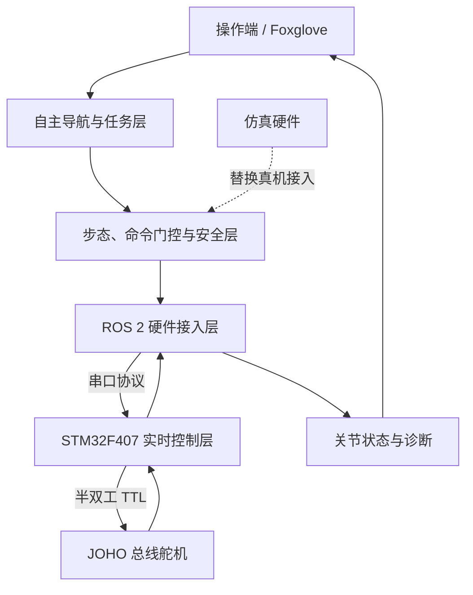

# 蛇形机器人项目架构

## 1. 文档目标

本文用于帮助新成员在较短时间内理解本项目的软硬件分层、模块边界、数据流、
开发环境及六人协作方式。阅读完成后，成员应能回答以下问题：

1. STM32、ROS 2 和 Docker 分别负责什么？
2. 真机与仿真如何复用相同的上层算法？
3. 自己负责哪些目录、向其他成员提供什么接口？


> 当前项目处于架构搭建阶段：STM32 舵机控制已经有实际代码；多数
> `ROS-Packages` 目前只有 README 占位文件。本文中标为“目标”的节点和话题
> 是后续实现约定，不表示它们已经完成。

## 2. 一句话理解系统

STM32 负责稳定、及时地控制舵机；上层电脑负责 ROS 2 算法、任务决策和监控；
Docker 负责让不同电脑使用一致的软件环境，但不参与实时控制。

## 3. 总体分层



### 3.1 实时控制层：STM32

目录：`firmware/stm32f407_snake/`

主要职责：

- 按固定周期计算或接收关节目标；
- 通过 USART3 半双工 TTL 驱动 JOHO 总线舵机；
- 完成舵机 ID 映射、安装方向和零位补偿；
- 使用 SyncWrite 同步下发多个舵机目标；
- 读取舵机状态并处理通信超时；
- 即使上层电脑失联，也要进入可预期的安全状态。

重要代码：

| 路径 | 作用 |
| --- | --- |
| `Application/gait.c` | MCU 侧参数化步态和关节映射 |
| `Drivers/Board/joho_servo/uart_servo_lite.c` | JOHO 舵机协议 |
| `Drivers/Board/ring_buffer/ring_buffer.c` | UART 中断收发缓冲 |
| `Core/Src/usart.c` | 串口与半双工方向控制 |
| `Core/Src/main.c` | 初始化与主循环调度 |

安全边界：急停、通信看门狗、角度限幅等底线保护不能只放在上层电脑中。

### 3.2 ROS 2 控制与硬件接入层

对应规划包：

- `snake_interfaces`：全项目共用消息、服务和动作定义；
- `snake_mcu_hardware`：串口协议、MCU 连接和 ros2_control 硬件接口；
- `snake_joint_state_estimator`：融合反馈并发布可信关节状态；
- `snake_gait_controller`：把速度或步态参数转换为多关节轨迹；
- `snake_command_gate`：仲裁手动、导航、测试等多个命令来源；
- `snake_safety`：限位、超时、急停和故障降级；
- `snake_bringup`：用 launch 文件组合真机节点。


### 3.3 自主与任务层

对应目录：`ROS-Packages/snake_navigation/` 和 `Stacks/autonomy/`。

主要职责是接收任务目标，完成定位、路径或行为规划，再输出标准化运动命令。
自主模块不能绕过 `snake_command_gate` 和 `snake_safety` 直接控制舵机。

### 3.4 模型与仿真层

对应规划包：

- `snake_description`：URDF/Xacro、关节、坐标系、碰撞和可视化模型；
- `snake_sim_hardware`：用仿真对象实现与真机相同的硬件抽象；
- `snake_sim_bringup`：启动模型、仿真硬件、控制器及测试场景；
- `simulation/`：保存整机仿真的入口和资源。

理想状态下，真机和仿真只替换“硬件实现”，步态、导航、安全和监控模块保持
不变，这样算法可以先在开发电脑验证，再接入实体机器人。

### 3.5 监控与部署层

对应目录：

- `ROS-Packages/snake_monitoring`：诊断、遥测以及 Foxglove 扩展；
- `Stacks/monitoring`：监控运行镜像和界面配置；
- `Stacks/control`：控制栈业务镜像；
- `Stacks/autonomy`：自主栈业务镜像；
- `Stacks/base`：三个业务镜像共用的 ROS 2 基础环境；
- `Stacks/snake_robot_system/compose.yaml`：多容器编排草案；
- `script/`：镜像构建和容器辅助脚本。

基础镜像只负责工具链和公共依赖。实际运行机器人的是 control、autonomy 和
monitoring 等业务容器，而不是基础镜像本身。


接口约定：

- 角度统一使用弧度，时间统一使用秒，速度写明是关节速度还是机体速度；
- 每条跨进程状态消息都应包含时间戳；
- 串口协议应包含版本、长度、序号、消息类型和校验；
- command gate 任一时刻只允许一个有效命令源；
- 命令超时后默认停止，不能继续执行最后一次运动命令；
- 真机和仿真应发布相同语义的 `/joint_states` 与诊断信息。


## 4. 推荐协作流程

### 4.1 分支与提交

- 每个任务使用短生命周期分支，例如 `feature/mcu-watchdog`；
- 一次提交只解决一个明确问题；
- PR 描述包含“改了什么、如何验证、影响哪些接口”；
- 公共接口先提交设计，再提交实现；
- 至少由表中主要评审人之一批准后合并。

不要提交 `build/`、`install/`、`log/`、编辑器缓存或固件中间产物。

### 4.2 接口先行

涉及多人时采用以下顺序：

1. 写接口提案和示例数据；
2. 相关负责人评审名称、字段、单位、频率、超时和错误行为；
3. 合并接口及 mock；
4. 各负责人基于同一接口并行实现；
5. F 将各模块加入集成启动和持续测试。


## 8. 多电脑开发环境

各电脑克隆同一仓库后，在仓库根目录构建适配本机架构的基础镜像：

```bash
./script/build-base.sh
```

脚本支持常见 PC 的 `linux/amd64` 和 64 位 ARM 电脑的 `linux/arm64`。各电脑
本地都使用 `snake-ros-base:jazzy` 标签，业务 Dockerfile 因此无需因 CPU 架构
而改动。

开发时建议：

- A 使用 ARM GCC 工具链和实物板卡；
- B 使用实物串口或录制数据/mock；
- C、D、E 日常优先使用仿真和 mock；
- F 定期在 amd64 开发机和 arm64 上层控制器各做一次构建验证。

## 9. 集成完成标准

一个模块“代码写完”不等于系统完成。最小闭环达到以下条件才算第一阶段完成：

- 所有 ROS 2 包能在干净环境中构建；
- 仿真与真机使用相同的关节名称、命令单位和反馈语义；
- 操作端命令能经过 gate、安全、步态和硬件接口到达执行器；
- 上层进程退出或串口断开后，机器人能在规定时间内安全停止；
- Foxglove 或日志中能定位当前命令源、关节目标、关节反馈和故障原因；
- amd64 和 arm64 环境都有可重复的构建记录；
- 每个模块至少有基础自动测试及明确负责人。

## 10. 新成员阅读顺序

1. 阅读本文，先理解模块边界；
2. 阅读 `firmware/stm32f407_snake/Project/README.md`，了解已有硬件能力；
3. 阅读自己负责目录中的 README 和 Dockerfile；
4. 与上下游负责人确认接口，不直接猜测字段与单位；
5. 使用 mock 或仿真完成第一次修改，再申请真机测试。

项目架构的关键不是目录数量，而是让每一层职责单一、接口可测试，并让六个人
能够在不依赖同一台实体机器的情况下并行工作。
